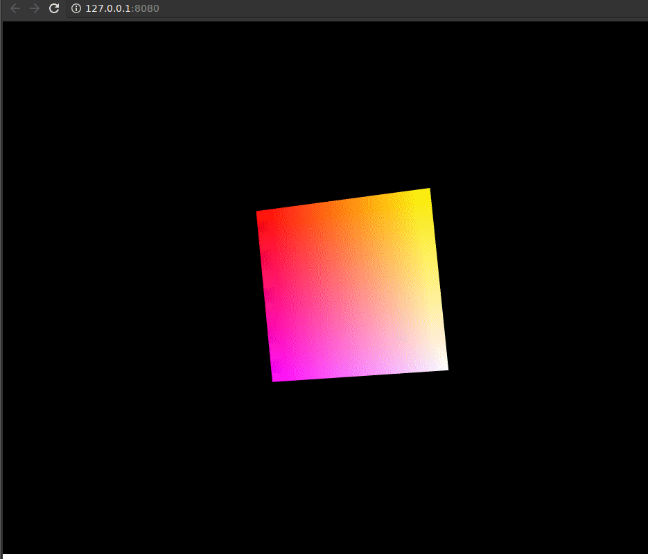

# rust-webgl2

This project is based on:

Rust + WebAssembly + WebGL 2.0 Demo

https://github.com/likr/rust-webgl2-example

The original demo can be found here:

https://likr.github.io/rust-webgl2-example

# Living Documentation
The information below was relevant to my first commit however, updating the
readme all the time won't provide any kind of history and my intention is to
document the process as I learn Rust with a focus on Webgl2.

So I've opened a ticket in this repository... I'll either update that ticket with new information
as I progress or add new tickets, not sure what works best yet.  Maybe the wiki is a better place?

This is a learning project so please feel free to jump in and play around, ask questions,
I'm happy to share what I've learned, who knows maybe this will become something... 

I don't have a "code of conduct" but I'm generally a friendly guy.. I don't have a lot of spare time, I'm
pushing it a bit spending time on this as it is, so I only ask that everyone be respectful of each other.  I'll
do my best to answer questions as soon as time permits...

I am totally open to PR's (there are no design objectives at this time so nothing reasonable will be rejected).  

The only thing I would ask is that the code be documented to help others understand it... My recommended approach is:

- Use in-line comments.
- Use commit notes.
- The PR request itself is a great way to explain what's going on.

# How to build (deprecated)
I'm using Debian 9 and followed this procedure to get up and running with
rust and Emscripten.  

https://users.rust-lang.org/t/compiling-to-the-web-with-rust-and-emscripten/7627

As of today (March 4 / 2018) I did _not_ have to use Rust nightly.

What I did have to do, however, is add the following to ~/.bashrc

```console
export PATH="$HOME/emsdk-portable/emscripten/1.37.35:$PATH"
```

and I find it necessary to call:
```console
$ source path/to/emsdk/emsdk_env.sh
```
from each bash session.. I haven't tried adding that to the script yet.

```console
$ source path/to/emsdk/emsdk_env.sh
$ cargo build --release --target=wasm32-unknown-emscripten
```

You can also build for asm.js like this:

```console
$ source path/to/emsdk/emsdk_env.sh
$ cargo build --release --target=asmjs-unknown-emscripten
```

but you will have to comment the wasm related call and uncomment the asmjs related call in
the index.html script stags.




